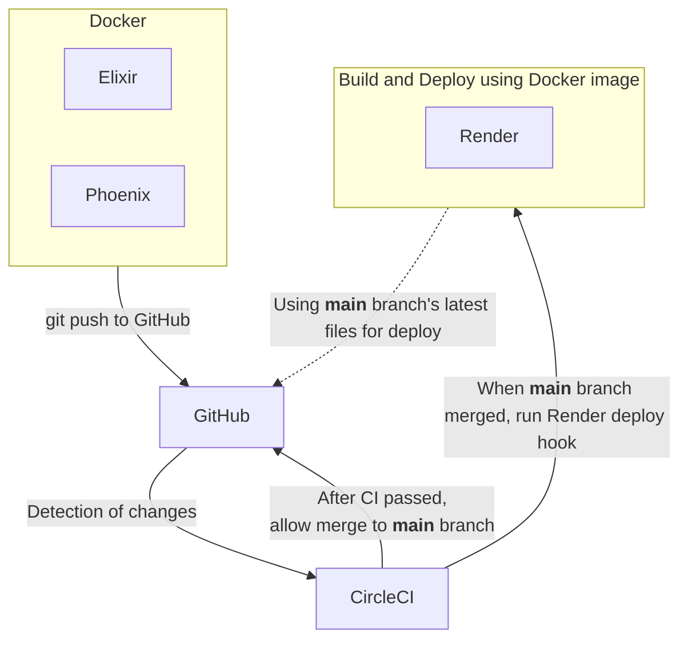

# kokura.ex

[](https://github.com/miolab/kokuraex)

# About

This repository is for the development of **kokura.ex**'s org website.



## Versions

- Elixir 1.16.2 (Erlang/OTP 26)
- Phoenix 1.7.11

## CI/CD tool

- CircleCI

## PaaS

- Render

---

## For Dev

- Prepare `SECRET_KEY_BASE` and `GITHUB_API_TOKEN` ([ref](https://github.com/settings/tokens)).
- Set them to .env file.

  ```sh
  docker compose run app mix phx.gen.secret
  ```

  ```sh
  cp app/.env.sample app/.env
  ```

- Set the environment variable to Render.
  - `SECRET_KEY_BASE`
  - `PORT`
  - `PHX_SERVER`
  - `GITHUB_API_TOKEN`

### Run application in local development

- Normal development (can debug by live reloading)

  ```sh
  docker compose build
  ```

  ```sh
  docker compose up
  ```

- Development verifying in a production environment

  ```sh
  docker build -f app/Dockerfile -t kokuraex_prod app
  ```

  ```sh
  ./script/docker_prod_verify.sh
  ```

---

# Other Information

The **previous system architecture** and **archived repositories** are as follows.

https://github.com/miolab/kokuraex_phx_1_6/tree/main


